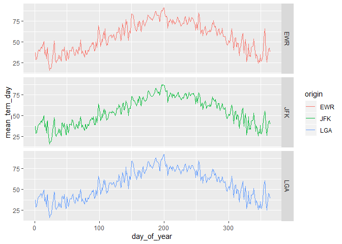
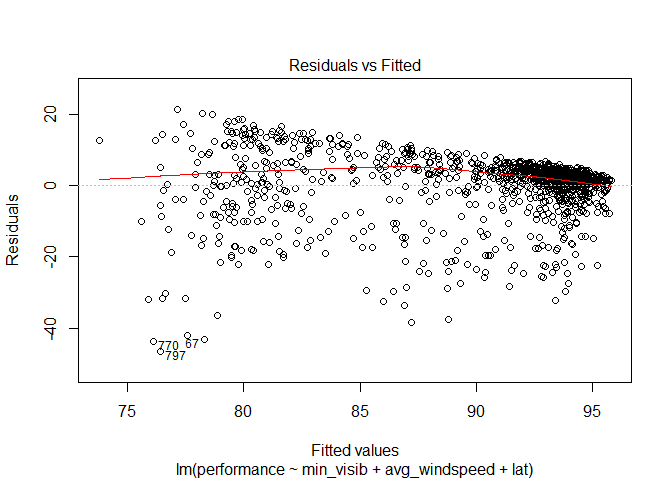
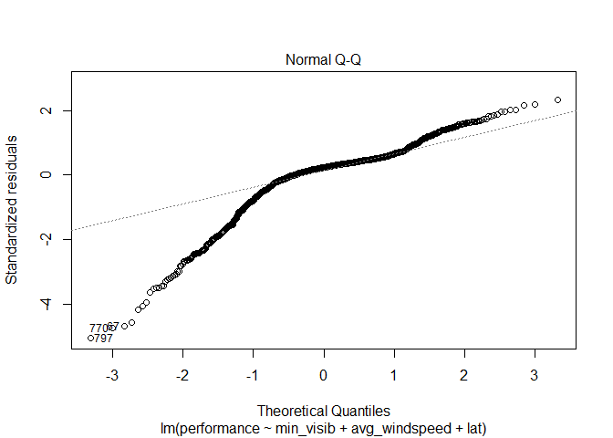
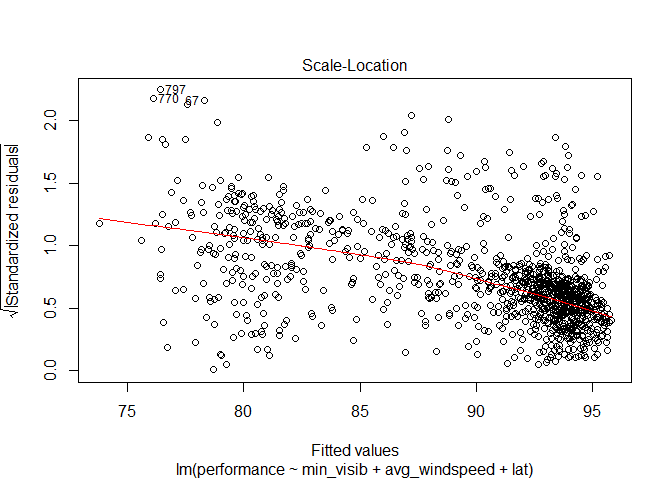
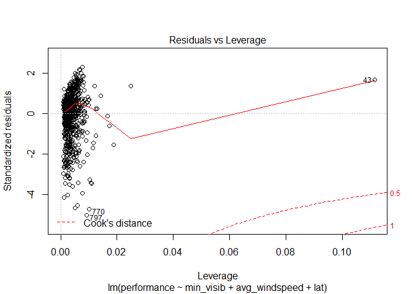
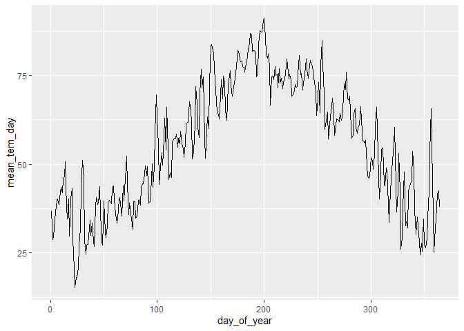
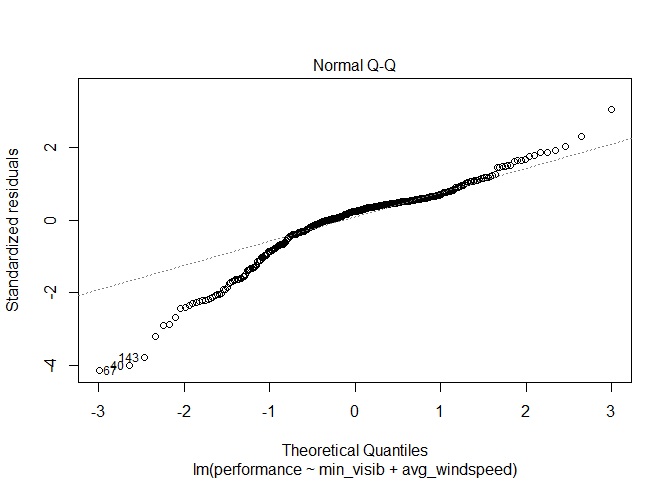
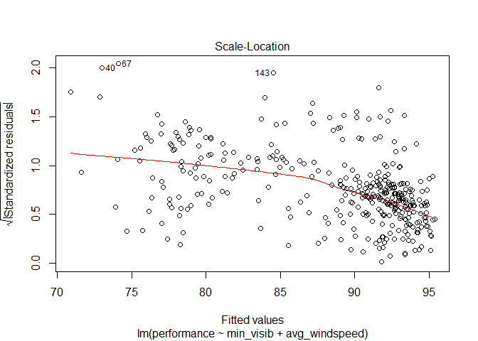
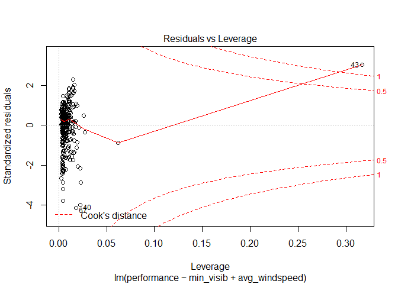

Practice Exam
=============

This practice exam asks you to do several code wrangling tasks that we
have done in class so far.

Clone this repo into Rstudio and fill in the necessary code. Then,
commit and push to github. Finally, turn in a link to canvas.

    ## -- Attaching packages ---------------------------------- tidyverse 1.3.0 --

    ## v ggplot2 3.2.1     v purrr   0.3.3
    ## v tibble  2.1.3     v dplyr   0.8.3
    ## v tidyr   1.0.2     v stringr 1.4.0
    ## v readr   1.3.1     v forcats 0.4.0

    ## -- Conflicts ------------------------------------- tidyverse_conflicts() --
    ## x dplyr::filter() masks stats::filter()
    ## x dplyr::lag()    masks stats::lag()

Make a plot with three facets, one for each airport in the weather data.
The x-axis should be the day of the year (1:365) and the y-axis should
be the mean temperature recorded on that day, at that airport.

    library(lubridate)

    ## 
    ## Attaching package: 'lubridate'

    ## The following object is masked from 'package:base':
    ## 
    ##     date

    weather %>% mutate(day_of_year = yday(time_hour))%>%
      group_by(origin, day_of_year)%>%
      summarise(mean_tem_day = mean(temp, na.rm = T))%>%
      ggplot()+geom_line(aes(day_of_year, mean_tem_day,color = origin))+facet_grid(rows = vars(origin))

Make a non-tidy matrix of that data where each row is an airport and
each column is a day of the year.

    data_for_change <- weather %>% mutate(day_of_year = yday(time_hour))%>%
      group_by(origin, day_of_year)%>%
      summarise(mean_tem_day = mean(temp, na.rm = T))
    library(tidyr)

    data_for_change %>% 
      pivot_wider( names_from = "origin", values_from = "mean_tem_day")

    ## # A tibble: 364 x 4
    ##    day_of_year   EWR   JFK   LGA
    ##          <dbl> <dbl> <dbl> <dbl>
    ##  1           1  36.8  36.9  37.2
    ##  2           2  28.7  28.6  28.8
    ##  3           3  29.6  30.1  30.3
    ##  4           4  34.3  34.7  35.8
    ##  5           5  36.6  36.8  38.3
    ##  6           6  39.9  39.3  41.0
    ##  7           7  40.3  40.1  41.4
    ##  8           8  38.6  39.4  42.3
    ##  9           9  42.1  42.7  44.9
    ## 10          10  43.6  43.6  44.3
    ## # ... with 354 more rows

For each (airport, day) contruct a tidy data set of the airport’s
“performance” as the proportion of flights that departed less than an
hour late.

    library(expss)

    ## 
    ## Attaching package: 'expss'

    ## The following objects are masked from 'package:stringr':
    ## 
    ##     fixed, regex

    ## The following objects are masked from 'package:dplyr':
    ## 
    ##     between, compute, contains, first, last, na_if, recode, vars

    ## The following objects are masked from 'package:purrr':
    ## 
    ##     keep, modify, modify_if, transpose

    ## The following objects are masked from 'package:tidyr':
    ## 
    ##     contains, nest

    ## The following object is masked from 'package:ggplot2':
    ## 
    ##     vars

    library(data.table)

    ## 
    ## Attaching package: 'data.table'

    ## The following objects are masked from 'package:expss':
    ## 
    ##     copy, like

    ## The following objects are masked from 'package:lubridate':
    ## 
    ##     hour, isoweek, mday, minute, month, quarter, second, wday,
    ##     week, yday, year

    ## The following objects are masked from 'package:dplyr':
    ## 
    ##     between, first, last

    ## The following object is masked from 'package:purrr':
    ## 
    ##     transpose

    library(lubridate)
    perforamnce_data <- flights%>%
      #tidyr::unite("year_month_day",year,month,day,sep = "-",remove = TRUE)%>%
      mutate(year_month_day = make_datetime(year,month,day))%>%
      group_by(origin,year_month_day)%>%
      summarise(n1=sum(dep_delay<60,na.rm = T),n2=n())%>%
      mutate(performance = n1/n2*100)%>%
      select(-n1,-n2)

Construct a tidy data set to that give weather summaries for each
(airport, day). Use the total precipitation, minimum visibility, maximum
wind\_gust, and average wind\_speed.

    weathersummary_data <- weather%>%
      mutate(year_month_day = make_datetime(year,month,day))%>%
      group_by(origin, year_month_day)%>%
      summarise(total_percipitation = sum(precip, na.rm = T), min_visib = min(visib), max_windgust = max(wind_gust), avg_windspeed = mean(wind_speed, na.rm = T))

Construct a linear model to predict the performance of each
(airport,day) using the weather summaries and a “fixed effect” for each
airport. Display the summaries.

    model_data <- perforamnce_data %>%
      left_join(weathersummary_data, by = c("origin", "year_month_day"))%>%
      left_join(airports, by = c("origin" = "faa"))
    line_model <- lm(performance~min_visib+avg_windspeed+lat, model_data)
    summary(line_model)

    ## 
    ## Call:
    ## lm(formula = performance ~ min_visib + avg_windspeed + lat, data = model_data)
    ## 
    ## Residuals:
    ##     Min      1Q  Median      3Q     Max 
    ## -46.585  -1.988   2.210   4.469  21.488 
    ## 
    ## Coefficients:
    ##                Estimate Std. Error t value Pr(>|t|)    
    ## (Intercept)   378.22887  202.48005   1.868    0.062 .  
    ## min_visib       1.53630    0.08101  18.964  < 2e-16 ***
    ## avg_windspeed  -0.29490    0.06719  -4.389 1.25e-05 ***
    ## lat            -7.29226    4.97420  -1.466    0.143    
    ## ---
    ## Signif. codes:  0 '***' 0.001 '**' 0.01 '*' 0.05 '.' 0.1 ' ' 1
    ## 
    ## Residual standard error: 9.283 on 1088 degrees of freedom
    ##   (3 observations deleted due to missingness)
    ## Multiple R-squared:  0.259,  Adjusted R-squared:  0.2569 
    ## F-statistic: 126.7 on 3 and 1088 DF,  p-value: < 2.2e-16

    plot(line_model)

Repeat the above, but only for EWR. Obviously, exclude the fixed effect
for each airport.

    weather %>% mutate(day_of_year = yday(time_hour))%>%
      group_by(origin, day_of_year)%>%
      summarise(mean_tem_day = mean(temp, na.rm = T))%>%
      filter(origin == "EWR")%>%
      ggplot()+geom_line(aes(day_of_year, mean_tem_day))

    EWR <- weather %>% mutate(day_of_year = yday(time_hour))%>%
      group_by(origin, day_of_year)%>%
      summarise(mean_tem_day = mean(temp, na.rm = T))%>%
      filter(origin == "EWR")

    EWR %>% pivot_wider( names_from = "origin", values_from = "mean_tem_day")

    ## # A tibble: 364 x 2
    ##    day_of_year   EWR
    ##          <int> <dbl>
    ##  1           1  36.8
    ##  2           2  28.7
    ##  3           3  29.6
    ##  4           4  34.3
    ##  5           5  36.6
    ##  6           6  39.9
    ##  7           7  40.3
    ##  8           8  38.6
    ##  9           9  42.1
    ## 10          10  43.6
    ## # ... with 354 more rows

    perforamnce_data_1 <- flights%>%
      #tidyr::unite("year_month_day",year,month,day,sep = "-",remove = TRUE)%>%
      mutate(year_month_day = make_datetime(year,month,day))%>%
      group_by(origin,year_month_day)%>%
      summarise(n1=sum(dep_delay<60,na.rm = T),n2=n())%>%
      mutate(performance = n1/n2*100)%>%
      select(-n1,-n2)%>%
      filter(origin == "EWR")

    weathersummary_data_EWR <- weather%>%
      mutate(year_month_day = make_datetime(year,month,day))%>%
      group_by(origin, year_month_day)%>%
      summarise(total_percipitation = sum(precip, na.rm = T), min_visib = min(visib), max_windgust = max(wind_gust), avg_windspeed = mean(wind_speed, na.rm = T))

    model_data_EWR <- perforamnce_data_1 %>%
      left_join(weathersummary_data_EWR, by = c("origin", "year_month_day"))%>%
      left_join(airports, by = c("origin" = "faa"))
    line_model_EWR <- lm(performance~min_visib+avg_windspeed, model_data_EWR)
    summary(line_model_EWR)

    ## 
    ## Call:
    ## lm(formula = performance ~ min_visib + avg_windspeed, data = model_data_EWR)
    ## 
    ## Residuals:
    ##     Min      1Q  Median      3Q     Max 
    ## -39.077  -3.453   2.288   5.123  23.975 
    ## 
    ## Coefficients:
    ##               Estimate Std. Error t value Pr(>|t|)    
    ## (Intercept)    79.4756     1.5554  51.098  < 2e-16 ***
    ## min_visib       1.7563     0.1481  11.862  < 2e-16 ***
    ## avg_windspeed  -0.4637     0.1139  -4.073 5.71e-05 ***
    ## ---
    ## Signif. codes:  0 '***' 0.001 '**' 0.01 '*' 0.05 '.' 0.1 ' ' 1
    ## 
    ## Residual standard error: 9.491 on 361 degrees of freedom
    ##   (1 observation deleted due to missingness)
    ## Multiple R-squared:  0.2921, Adjusted R-squared:  0.2882 
    ## F-statistic: 74.49 on 2 and 361 DF,  p-value: < 2.2e-16

    plot(line_model_EWR)

